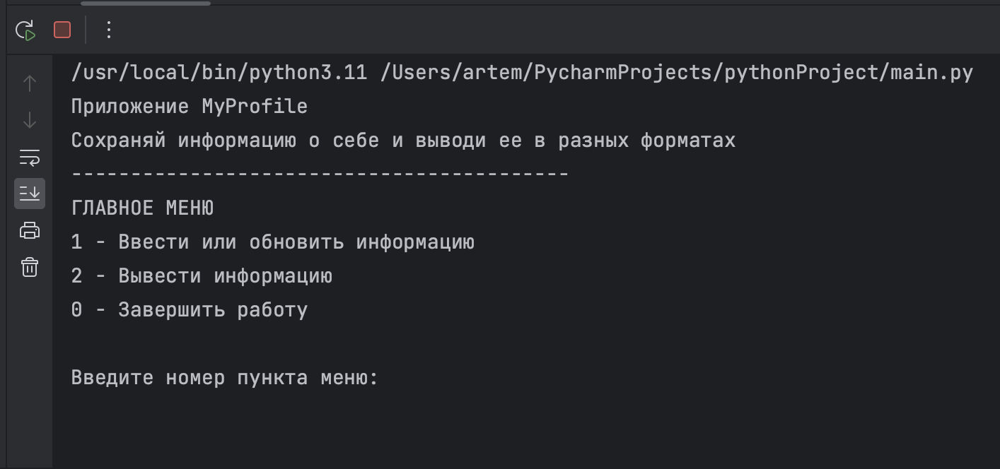
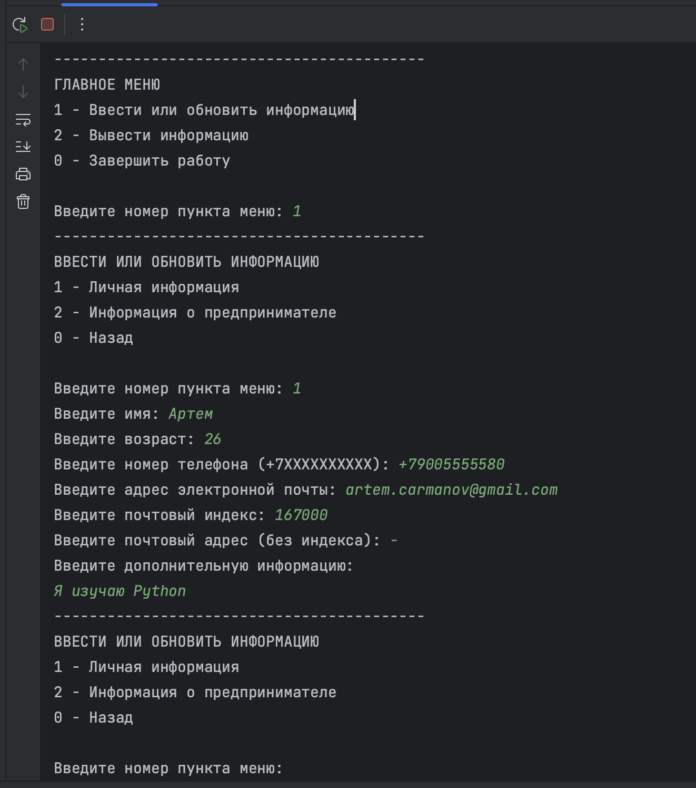
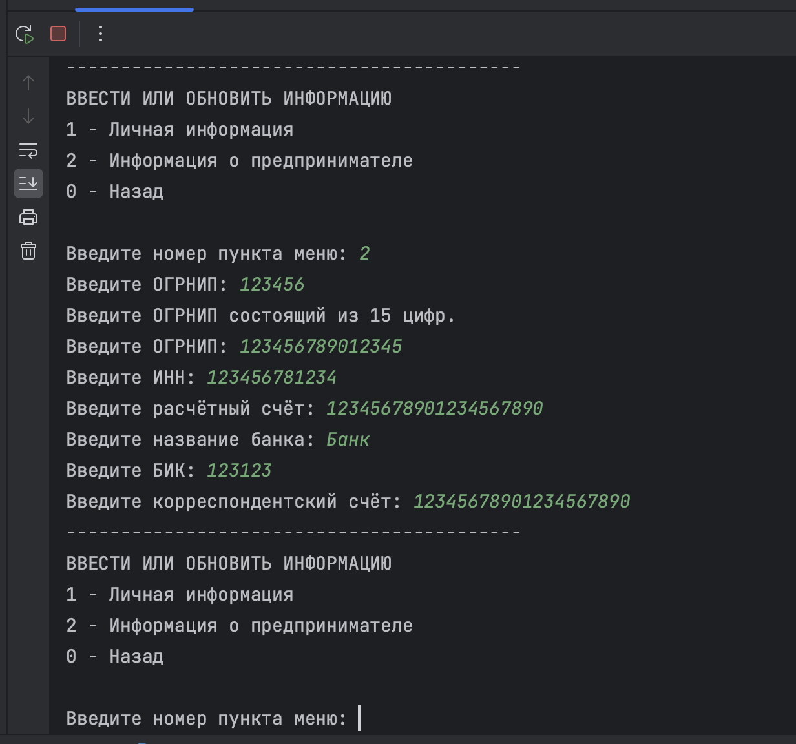
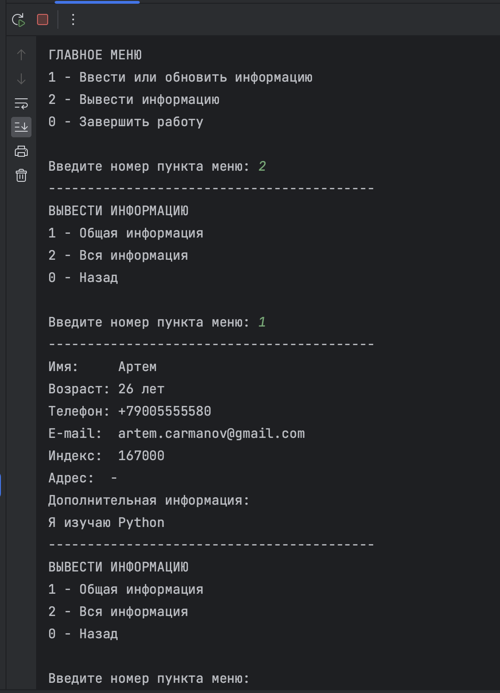
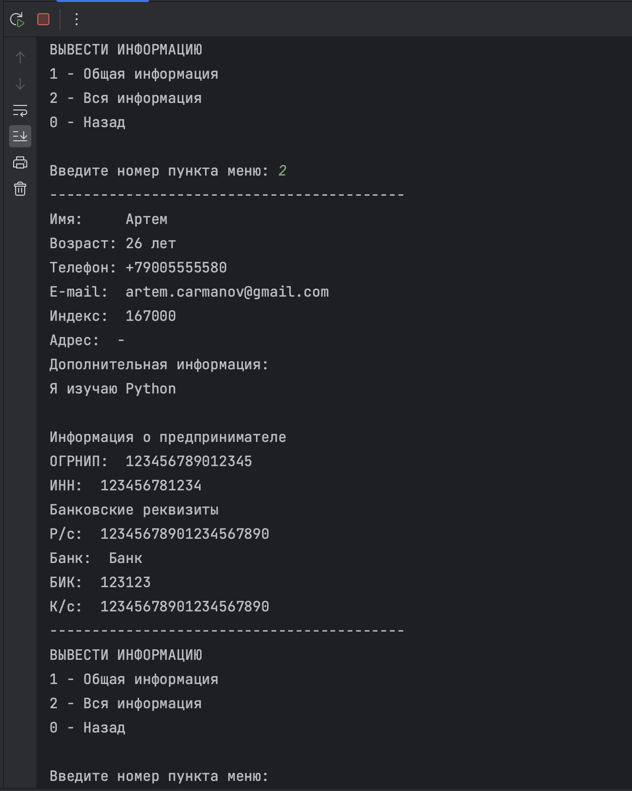

# Приложение «MyProfile для предпринимателей»
## Навигация
* [Краткое описание](#description)
* [Структура приложения](#structure)
* [Ввод информации](#input)
  * [Личная информация](#input-personal)
  * [Информация о предпринимателе](#input-entrepreneur)
* [Вывод информации](#output)
  * [Личная информация](#output-personal)
  * [Вся информация](#output-all)
* [Внешний вид и UI](#templates)
  * [Главное меню](#template-main)
  * [Ввод личной информации](#template-input-personal)
  * [Ввод информации о предпринимателе](#template-input-entrepreneur)
  * [Вывод общей информации](#template-output-general)
  * [Вывод всей информации](#template-output-all)

## Краткое описание
Консольное приложение для составления карточки профиля предпринимателя.\
В приложении можно сохранять личную информацию о себе (имя, возраст, телефон, электронная почта, дополнительная информация) и выводить её.\
Также может храниться информация о предпринимательстве, например, ИНН и банковские реквизиты. 

## Структура приложения
Структура приложения состоит из следующих разделов:
* 1 — Ввести или обновить информацию
  * 1 — Личная информация
  * 2 — Информация о предпринимателе
  * 0 — Назад
* 2 — Вывести информацию
  * 1 — Личная информация 
  * 2 — Вся информация
  * 0 — Назад
* 0 — Завершить работу

## Ввод информации

### Личная информация
При выборе пункта меню «1 — Личная информация» пользователь вводит информацию в следующие поля:
  * «Имя»
  * «Возраст»
  * «Телефон»
  * «Электронная почта»
  * «Индекс»
  * «Почтовый адрес»
  * «Дополнительная информация»

### Информация о предпринимателе
При выборе пункта меню «2 — Информация о предпринимателе» пользователь вводит информацию в следующие поля:
  * ОГРНИП
  * ИНН
  * «Расчётный счёт»
  * «Название банка»
  * БИК
  * «Корреспондентский счёт»

Поле ОГРНИП содержит 15 цифр, а расчётный счёт — 20 цифр.

## Вывод информации

### Личная информация
При выборе пункта меню «1 — Личная информация» выводятся следующие поля:
  * «Имя»
  * «Возраст»
  * «Телефон»
  * «Электронная почта»
  * «Индекс»
  * «Почтовый адрес»
  * «Дополнительная информация»

### Вся информация
При выборе пункта меню «2 — Вся информация» выводятся следующие поля:
  * «Имя»
  * «Возраст»
  * «Телефон»
  * «Электронная почта»
  * «Индекс»
  * «Почтовый адрес»
  * «Дополнительная информация»
  * ОГРНИП
  * ИНН
  * «Расчётный счёт»
  * «Название банка»
  * БИК
  * «Корреспондентский счёт»

## Внешний вид и UI

### Главное меню

### Ввод личной информации

### Ввод информации о предпринимателе

### Вывод общей информации

### Вывод всей информации

